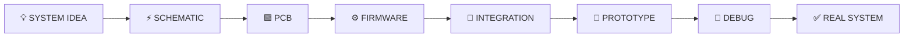
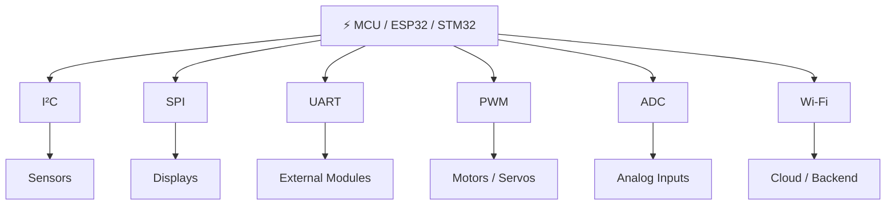
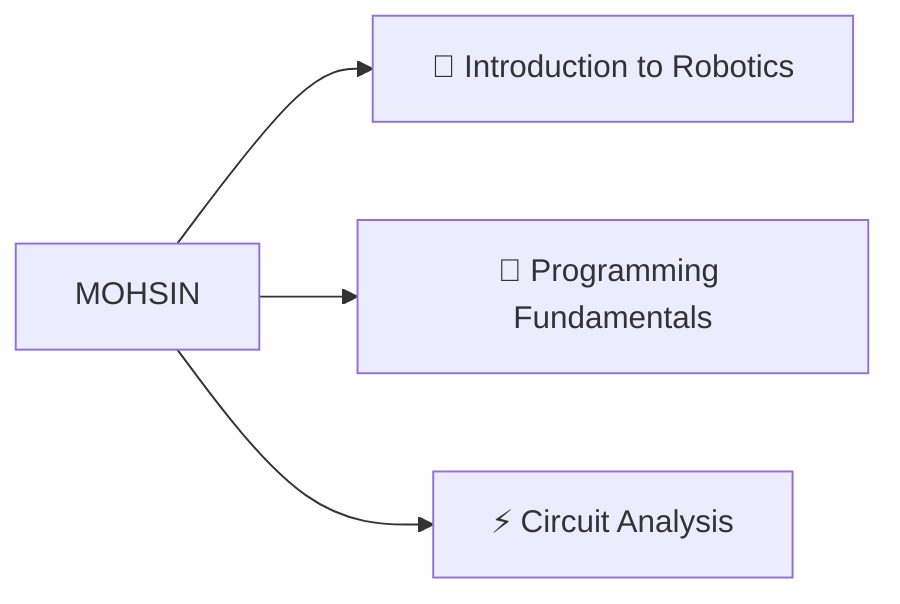
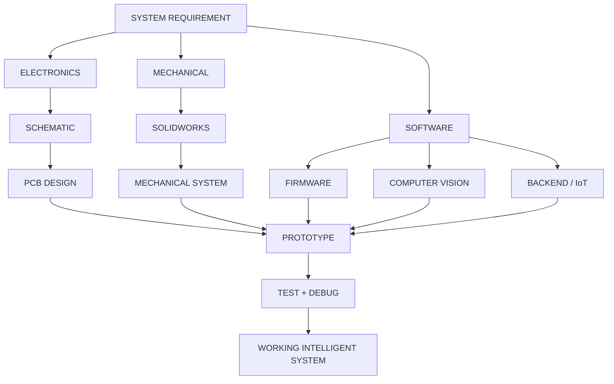

<!-- =========================================================
     MOHSIN ALI — GITHUB PROFILE README
     Robotics • PCB • Embedded • Firmware • Computer Vision
========================================================== -->

<div align="center">


<br/>

<a href="https://github.com/Mohsin-Ali0987">

</a>

<a href="https://www.linkedin.com/in/mohsin-ali-466907355/">

</a>

<a href="https://www.upwork.com/freelancers/~01bbeac1a82e2bb336">

</a>

<a href="mailto:muhsanch098@gmail.com">

</a>

<br/><br/>


</div>

---

<div align="center">

## `◉ SYSTEM STATUS`


<br/>


</div>

<br/>

```text
╭────────────────────────────────────────────────────────────────────────────╮
│                                                                            │
│     PCB DESIGN        EMBEDDED SYSTEMS        FIRMWARE        ROBOTICS      │
│         ●──────────────────●────────────────────●──────────────●            │
│                                                                            │
│                   BUILDING INTELLIGENT HARDWARE                            │
│                                                                            │
│       schematic  →  board  →  firmware  →  integration  →  reality        │
│                                                                            │
╰────────────────────────────────────────────────────────────────────────────╯
```

---

# `01 // WHO_AM_I`

```yaml
engineer:
  name: Mohsin Ali

  domains:
    - Robotics & Intelligent Systems
    - PCB Design
    - Embedded Systems
    - Firmware Development
    - Electronics
    - Computer Vision

  current_role:
    title: Manager — PCB Design, Firmware & Embedded Systems
    company: OneStop Engineering & Tech Lab
    location: Michigan, USA

  experience:
    hands_on: 4+ years

  engineering_philosophy:
    - Design
    - Build
    - Test
    - Break
    - Debug
    - Improve
```

I work across the complete hardware-development cycle — from **requirements, schematic design and PCB layout** to **firmware, prototyping, debugging and final hardware–firmware integration**.

---

# `02 // ENGINEERING_PIPELINE`



<div align="center">

### `IDEA → ELECTRONICS → CODE → INTELLIGENCE → PHYSICAL SYSTEM`

</div>

---

# `03 // ENGINEERING_STACK`

<div align="center">

### PCB & ELECTRONICS


<br/>


</div>

<br/>

<div align="center">

### MICROCONTROLLERS


<br/>

`ESP32-S2` • `ESP32-S3` • `ESP32-C3` • `ESP32-C6`

</div>

<br/>

<div align="center">

### SOFTWARE & VISION


</div>

<br/>

<div align="center">

### ENGINEERING TOOLS


</div>

---

# `04 // MCU_SIGNAL_BUS`



<div align="center">


</div>

---

# `05 // FEATURED_SYSTEMS`

<div align="center">

## 🤖 `REAPER`

### Autonomous Robotic Platform

</div>

```text
                    ┌───────────────────┐
                    │     ESP32-CAM     │
                    └─────────┬─────────┘
                              │
                              ▼
                    ┌───────────────────┐
                    │   VISUAL INPUT    │
                    └─────────┬─────────┘
                              │
                              ▼
                    ┌───────────────────┐
                    │      OpenCV       │
                    └─────────┬─────────┘
                              │
                              ▼
                    ┌───────────────────┐
                    │ DECISION / LOGIC  │
                    └─────────┬─────────┘
                              │
                              ▼
                    ┌───────────────────┐
                    │ AUTONOMOUS ACTION │
                    └───────────────────┘
```

<div align="center">


</div>

> Autonomous robotic platform integrating embedded systems, robotics and computer vision.

<br/>

---

<div align="center">

## 🧠 `MOLY V1.0`

### AI Mini Companion Robot

</div>

```text
     ┌─────────┐       ┌─────────┐       ┌─────────┐
     │  TOUCH  │       │  OLED   │       │ SENSORS │
     └────┬────┘       └────┬────┘       └────┬────┘
          │                 │                 │
          └─────────────────┼─────────────────┘
                            │
                            ▼
                    ┌───────────────┐
                    │     ESP32     │
                    └───────┬───────┘
                            │
             ┌──────────────┼──────────────┐
             │              │              │
             ▼              ▼              ▼
         FIRMWARE         Wi-Fi        TELEMETRY
                                            │
                                            ▼
                              ┌─────────────────────┐
                              │ Node.js / Express   │
                              └──────────┬──────────┘
                                         │
                                         ▼
                              ┌─────────────────────┐
                              │    MongoDB Atlas    │
                              └──────────┬──────────┘
                                         │
                                         ▼
                              ┌─────────────────────┐
                              │   React Dashboard   │
                              └─────────────────────┘
```

<div align="center">


</div>

> Interactive robot combining custom hardware, embedded firmware, touch interaction, OLED UI, Wi-Fi, telemetry, backend services and web dashboards.

---

<div align="center">

## 📡 `LTC5548 // 2–14 GHz`

### RF / Microwave Mixer PCB

</div>

```text
                           LOCAL OSCILLATOR
                                  │
                                  ▼
 RF INPUT                 ┌────────────────┐
 2–14 GHz ───────────────►│    LTC5548     │
                          │   RF MIXER IC   │
                          └───────┬────────┘
                                  │
                                  ▼
                              IF OUTPUT
                               DC–6 GHz
                                  │
                                  ▼
                         SMA / RF INTERFACE
```

<div align="center">


</div>

> High-frequency PCB development involving RF component selection, SMA connectivity, power regulation and microwave layout considerations.

---

<div align="center">

## 🦾 `ROBOTIC ARM`

### 4-DOF / 5-DOF Robotic System

</div>

```text
                         ┌──────────────┐
                         │  CONTROLLER  │
                         └──────┬───────┘
                                │
                                ▼
                      ┌──────────────────┐
                      │ EMBEDDED CONTROL │
                      └────────┬─────────┘
                               │
             ┌─────────────────┼─────────────────┐
             │                 │                 │
             ▼                 ▼                 ▼
        ┌─────────┐       ┌─────────┐       ┌─────────┐
        │ JOINT 1 │       │ JOINT 2 │       │ JOINT 3 │
        └────┬────┘       └────┬────┘       └────┬────┘
             │                 │                 │
             ▼                 ▼                 ▼
           SERVO             SERVO             SERVO
```

<div align="center">


</div>

> Robotic arm systems developed using mechanical design, servo actuation and embedded control.

---

<div align="center">

## 🍎 `AUTOMATED APPLE SORTING`

</div>

```text
      APPLE
        │
        ▼
   ┌──────────┐
   │ SENSOR   │
   └────┬─────┘
        │
        ▼
   ┌──────────┐
   │  ESP32   │
   └────┬─────┘
        │
        ▼
 ┌──────────────┐
 │ SORTING LOGIC│
 └──────┬───────┘
        │
   ┌────┴────┐
   ▼         ▼
CONVEYOR   ACTUATOR
```

<div align="center">


</div>

---

# `06 // CURRENT_COMMAND`

```text
╭──────────────────────────────────────────────────────────────────────────╮
│                                                                          │
│             ONESTOP ENGINEERING & TECH LAB — MICHIGAN, USA              │
│                                                                          │
│         MANAGER — PCB DESIGN, FIRMWARE & EMBEDDED SYSTEMS                │
│                                                                          │
├──────────────────────────────────────────────────────────────────────────┤
│                                                                          │
│   ◉ PCB architecture & schematic design                                  │
│                                                                          │
│   ◉ PCB layout & engineering review                                      │
│                                                                          │
│   ◉ Embedded firmware development                                        │
│                                                                          │
│   ◉ Hardware debugging & troubleshooting                                 │
│                                                                          │
│   ◉ Hardware ↔ firmware integration                                      │
│                                                                          │
│   ◉ Component selection & BOM engineering                                │
│                                                                          │
│   ◉ Robotics / IoT development                                           │
│                                                                          │
│   ◉ RF / microwave PCB engineering                                       │
│                                                                          │
│   ◉ Technical leadership across engineering teams                        │
│                                                                          │
╰──────────────────────────────────────────────────────────────────────────╯
```

---

# `07 // ENGINEERING_DOMAINS`

```text
PCB ENGINEERING
████████████████████████████████████████

EMBEDDED SYSTEMS
████████████████████████████████████████

FIRMWARE
██████████████████████████████████████░░

ROBOTICS
██████████████████████████████████████░░

ELECTRONICS
██████████████████████████████████████░░

COMPUTER VISION
████████████████████████████████░░░░░░░░

RF / MICROWAVE
██████████████████████████████░░░░░░░░░░

IoT / BACKEND
████████████████████████████░░░░░░░░░░░░
```

---

# `08 // ACHIEVEMENT_LOG`

<div align="center">


</div>

<br/>

```diff
+ 2026  Altium Global Scholarship Recipient

+ 2026  Altium Education PCB Design Course

+ 2025  OpenCV Boot Camp
        Examination Score: 98%

+ 2024  1st Prize
        Circuit Debugging Competition

+ 2024  Winner
        PGC Robotics Exhibition

+ 2024  Developed
        REAPER Autonomous Robot
```

---

# `09 // EDUCATION_NODE`

<div align="center">

### 🎓 BS ROBOTICS & INTELLIGENT SYSTEMS

**University of Management and Technology — Lahore**

<br/>


</div>

<br/>

```text
2024 ●━━━━━━━━━━━━━━━━━━━━━━━━━━━━━━━━━━━━━━━━━━━━━━━━━━○ 2028
                              │
                              │
                         CGPA 3.60
```

---

# `10 // TEACHING_INTERFACE`

<div align="center">

### `PEER TUTOR @ UMT`

</div>



<div align="center">

`ROBOTICS` • `PYTHON` • `CIRCUITS` • `MENTORING`

</div>

---

# `11 // TECH_MATRIX`

<div align="center">


</div>

<br/>

```text
┌───────────────────────────┬─────────────────────────────┐
│ HARDWARE                  │ SOFTWARE                    │
├───────────────────────────┼─────────────────────────────┤
│ Altium Designer           │ C / C++                     │
│ EasyEDA / EasyEDA Pro     │ Python                      │
│ KiCad                     │ JavaScript                  │
│ ESP32                     │ Node.js                     │
│ STM32                     │ Express.js                  │
│ Arduino                   │ React                       │
│ RF Electronics            │ MongoDB                     │
│ Sensors / Actuators       │ OpenCV                      │
│ Servo Systems             │ MATLAB                      │
└───────────────────────────┴─────────────────────────────┘
```

---

# `12 // GITHUB_TELEMETRY`

<div align="center">


</div>

<br/>

<div align="center">


</div>

<br/>

<div align="center">


</div>

---

# `13 // SYSTEM_ARCHITECTURE`



---

# `14 // SPECIALIZATION_MAP`

```text
                               MOHSIN ALI
                                  │
          ┌───────────────────────┼───────────────────────┐
          │                       │                       │
          ▼                       ▼                       ▼

     PCB / HARDWARE           EMBEDDED               ROBOTICS
          │                       │                       │
     ┌────┼────┐             ┌────┼────┐             ┌────┼────┐
     │    │    │             │    │    │             │    │    │
     ▼    ▼    ▼             ▼    ▼    ▼             ▼    ▼    ▼

 Schematic RF  BOM          ESP32 STM32 C/C++       CV   Arms  Auto
 Layout                                         Systems
     │                       │                       │
     └───────────────────────┼───────────────────────┘
                             │
                             ▼
                 HARDWARE–FIRMWARE INTEGRATION
                             │
                             ▼
                    INTELLIGENT PHYSICAL SYSTEM
```

---

# `15 // WORKFLOW`

<div align="center">


→

→

→


<br/><br/>


→

→

→


</div>

---

# `16 // CONNECT`

<div align="center">

### Have an idea that needs to leave the screen and enter the real world?

<br/>

<a href="mailto:muhsanch098@gmail.com">

</a>

<br/><br/>

<a href="https://github.com/Mohsin-Ali0987">

</a>

<a href="https://www.linkedin.com/in/mohsin-ali-466907355/">

</a>

<a href="https://www.upwork.com/freelancers/~01bbeac1a82e2bb336">

</a>

</div>

<br/>

```text
╭───────────────────────────────────────────────────────────────────────╮
│                                                                       │
│                      HARDWARE THAT THINKS.                            │
│                                                                       │
│          DESIGN  /  BUILD  /  TEST  /  DEBUG  /  IMPROVE             │
│                                                                       │
╰───────────────────────────────────────────────────────────────────────╯
```

<div align="center">

### `PCB × EMBEDDED × FIRMWARE × ROBOTICS × INTELLIGENCE`

<br/>


</div>
